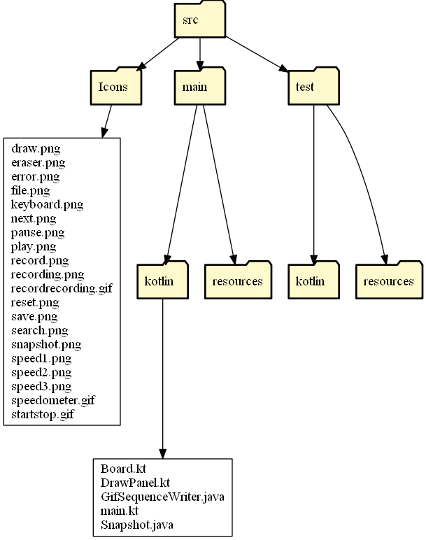

# Game of Life Simulator

Conway's Game of Life is a classic one player game/simulation. Read more about it on [Wikipedia](https://en.wikipedia.org/wiki/Conway%27s_Game_of_Life).

The Game of Life is basically a board of cells. Cells can be either alive or dead. Whether or not a cell lives on into the next generation is governed by these four rules (rules from Wikipedia):

* Any live cell with fewer than two live neighbours dies, as if by underpopulation.
* Any live cell with two or three live neighbours lives on to the next generation.
* Any live cell with more than three live neighbours dies, as if by overpopulation.
* Any dead cell with exactly three live neighbours becomes a live cell, as if by reproduction.

This app allows the user to create their own starting conditions and simulate according to these rules. Additionally, the user can save/load in starting conditions from `.golf` (Game of Life File) files. The user can record snapshots of one frame of the simulation as a transparent `.png`, or record a simulation and convert it to a transparent `.gif`.

# The App


<br />

### Buttons/Icons Descriptions

Icon | Key | Description
--- | --- | ---
 | `RIGHT ARROW` | Moves the simulation to the next generation according to the rules above.
 | `BACKSPACE` | Clears the simulation board.
 | `SHIFT+S` | Saves the current state of the board as a `.golf` file.
 | `C` | Saves the current state of the board as a `.png` file.
 | `R` | Toggles Recording Mode. If recording mode is on, any changes made to the board by clicking **NEXT** or **START/STOP** are recorded and saved into a `.gif` file.
 | `F` | Opens all `.golf` files and allows the user to load in a new simulation state.
 | | When the **OPEN** button is pressed, this icon appears next to all valid `.golf` files.

## `.golf` Files

The `.golf` file format is shown below. It stands for **g**ame **o**f **l**ife **f**ile. The first number is the size of one side of the simulation board. It is followed by a `:`. The series of numbers that come after this represents the coordinates on the board that are `true`. If any of the numbers in this list are greater than or equal to the size squared or negative, the file is marked as corrupted. If the file contains any characters other than the numbers `0-9`, commas (`,`) or colons (`:`) the file is marked as corrupted.

```
SIZE:index1,index2,index3,...

// Example:

50:1689,1639,1589,1439,1389,...
```

Given an `x` coordinate and a `y` coordinate on a board with size `size`, the formula to calculate the coordinates shown in the list above is `coordinate = x * size + y`. If you'd like to create your own designs and load them into the simulator, simply create a file in the format above, where you specify the size of your square board and the coordinates of every square you'd like to be on.

## PNG Files

When the **Snapshot** button is pressed, the current state of the simulation board is saved as a transparent `.png` file. An example is shown below.


<br />

## GIF Files

When the **Record** button is pressed, any time the **Next** or **Start** buttons are pressed, the board states are recorded. Once the user presses the **Record** button again, this will toggle off Recording Mode and will begin converting the recorded states to a `.gif` file with transparent background. If you've recorded a lot of frames, this conversion will take a while. The frame will be locked while the conversion takes place. An example is shown below.


<br />

# Parameters

There are several parameters you can tune to change your experience with this app. The files they are found in along with a description are shown below.

File | Constant Name | Default | Description
--- | --- | --- | ---
`src/main/main.kt` | `GRID` | `50` | The size of the simulation grid. This constant should be greater than `10`. There is no hard limit on the upper bound of this number, however at around `300` the squares on the simulation board become so small that they're almost invisible.
`src/main/Snapshot.java` | `RESOLUTION` | `20` | This value determines the "resolution" of the `.png` and `.gif` files that are created. The higher this number, the higher the resolution. The higher this number, the slower the Snapshot/Recording process will be.
`src/main/Snapshot.java` | `GIF_SPEED` | `1` | This value determines the framerate of the `.gif` files that are created. As long as it is greater than `1`, you're good to go.
`src/main/Snapshot.java` | `LOOP_CONTINOUSLY` | `true` | This value determines whether the `.gif` files loop continuously or not.

# `src` Directory Structure

The structure of the `src` directory is shown below.


<br />

NOTE: The directory structure graphic above was made with the [Directory Grapher Tool](https://github.com/AlexEidt/Directory-Grapher).

# Acknowledgements

The Java Code found in the `GifSequenceWriter.java` file under `src/main/kotlin` was made by **Elliot Kroo**. This work is licensed under the Creative Commons Attribution 3.0 Unported License. To view a copy of this license, visit http://creativecommons.org/licenses/by/3.0/ or send a letter to Creative Commons, 171 Second Street, Suite 300, San Francisco, California, 94105, USA.

Find the code on his website: https://web.archive.org/web/20191226041038/elliot.kroo.net/software/java/GifSequenceWriter/GifSequenceWriter.java

---

All Icons are from [Microsoft Office](https://support.microsoft.com/en-us/office/insert-icons-in-microsoft-office-e2459f17-3996-4795-996e-b9a13486fa79).